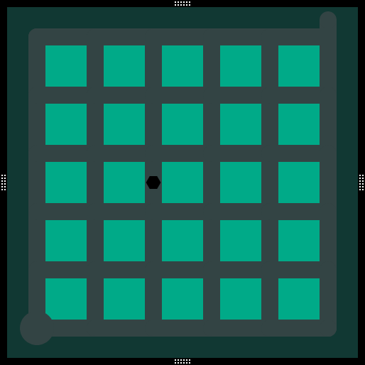
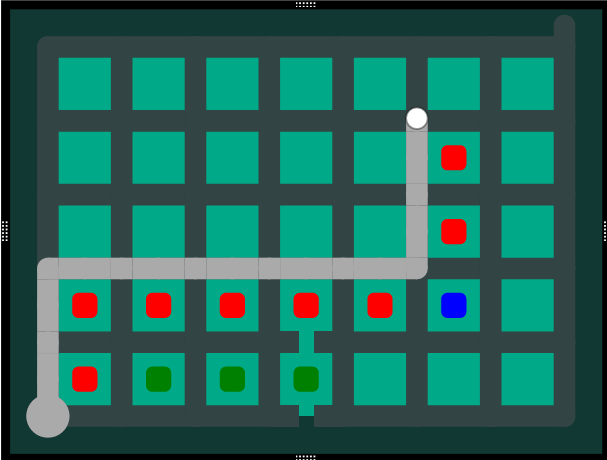
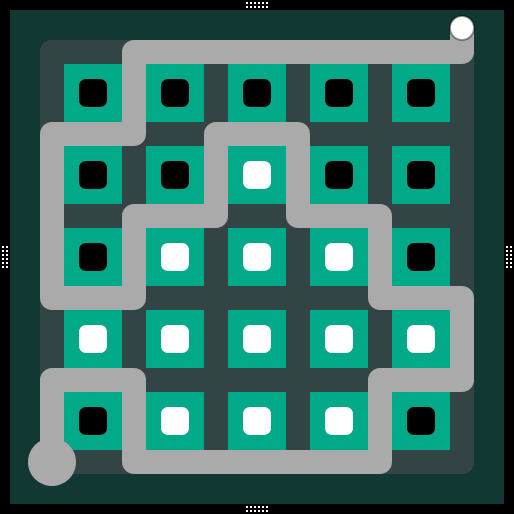

# This is a solver for puzzles of the game "The Witness"

This solver implements many features to detect dud solutions early on and reduce the number of states that need to be searched while still finding all the solutions.

Illustrations in this readme are made using https://witnesspuzzles.com/

## Implemented constraints
- Broken edges
- Stones (hexagones)
- Squares
- Stars
- Triangles
- Polyominoes

## Search features
The following search features are ordered chronologically from first implemented to last implemented. The times in the performance tables are not meant to be taken at face value, the important value is the number of states searched.
### Simple end reachability check
If the path goes in front of all the exits, we may stop searching. The test was done on an empty 5x5 puzzle with the starts and ends in opposite corners, which has 1262816 solutions.
|         | Number of states searched | Time |
|---------|---------------------------|------|
| Without | 31811177                  | 8.3s |
| With    | 17207595                  | 4.5s |

This feature approximately halves the number of states that need to be checked.

### Edges stones
Stones on edges that are perpandicular to the candidate solution path cannot be validated. The benchmark for this feature was done on the following puzzle, which has 518087 solutions:

|         | Number of states searched | Time |
|---------|---------------------------|------|
| Without | 17207595                  | 4.5s |
| With    |  8197554                  | 3.2s |

The time value is not very relevant as I have not spent much time optimizing code, what is relevant is that the search feature more than halves the amount of states that are considered while still finding all the solutions.

### Partial area checking
Even when an area is not yet fully enclosed, cells satisfying any of the following conditions must be part of the same area:
- Cell is directly adjacent to a side of the solution path (red, implemented)
- Cell on the outside corner of the solution path when it turns (blue, unimplemented)
- Cells that touch other cells that fill the previous conditions, and are unreachable by the solution path (green, unimplemented)

 
In this image, all cells containing squares must be part of the same area and therefore can be verified before the area is even enclosed.

The benchmark for this feature was done on the following puzzle, which has 12 solutions:

|         | Number of states searched | Time  |
|---------|---------------------------|-------|
| Without | 31811177                  | 12.9s |
| With    |      301                  | 300µs |

This is only implemented for squares for now, but this is the most effective constraint to implement it on.

## Planned search features

### Closed area checking
When an area becomes fully enclosed, you can check that it is valid. Before finishing the entire solution

### End rechability checking
If the only remaining end vertices are unreachable, then the current candidate solution may be aborted

End vertices maybe be unreachable for the following reasons:
- It is located in an enclosed area
- It is located located behind broken edges

### Tetris tiling optimisations
Before running a complete expensive we can check that the number of tetris blocks - number of neg tetris blocks = total cells in an area
During the actual tiling attempts, we can immediately throw out some of the combinations with some parity checks (thanks pcf)

## Motivation

I haven't played The Witness (yet), however I have watched many playthroughs and enjoy thinking about the puzzles.

When I was thinking about/researching this project, I started having optimisation ideas that I did not see other solvers implement, so I decided maybe it was worth doing my own.

I also wanted to start a new Rust project, to improve my skill in the language, so this project is a way for me to experiment with rust tests and documentation, and perhaps benchmarks if the project ever reaches that stage.

## Known bugs
None
