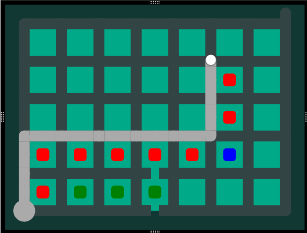

# This is a solver for puzzles of the game "The Witness"

This solver supports all puzzle elements for grid puzzles.

## Implemented constraints
- Broken edges

## Search features
### Breadth-first-search
In order to find the shorter solutions first, we use a non-recursive search strategy where the shortest known partial solutions so far are searched first.

## Planned search features

### Early area checking
Even when an area is not yet fully enclosed, cells satisfying any of the following conditions must be part of the same area:
- Cell is directly adjacent to a side of the solution path (red)
- Cell on the outside corner of the solution path when it turns (blue)
- Cells that touch other cells that fill the previous conditions, and are unreachable by the solution path (green)

In this image, all cells containing cells must be part of the same area and therefore can be verified before the area is even enclosed.

### Closed area checking
When an area becomes fully enclosed, you can check that it is valid. Before finishing the entire solution

### End rechability checking
If the only remaining end vertices are unreachable, then the current candidate solution may be aborted

End vertices maybe be unreachable for the following reasons:
- It is located in an enclosed area
- It is located located behind broken edges

### Edges stones
Stones on edges that are perpandicular to the candidate solution path cannot be validated.

## Motivation

I haven't played The Witness, however I have watched many playthroughs and enjoy thinking about the puzzles.

When I was thinking about/researching this project, I started having optimisation ideas that I did not see other solvers implement, so I decided maybe it was worth doing my own.

I also wanted to start a new Rust project, to improve my skill in the language, so this project is also a way for me to experiment with rust tests and documentation, and perhaps benchmarks if the project ever reaches that stage.
